  <picture>
    <source media="(prefers-color-scheme: dark)" srcset="./assets/dark.svg">
    <source media="(prefers-color-scheme: light)" srcset="./assets/light.svg">
    
  </picture>

# Hi there! I'm Regina 👋

I am a passionate **Frontend Engineer** based in České Budějovice, Czech Republic. I love building clean, modern, and interactive web applications using React, TypeScript, and Next.js, combined with AI-native workflows.

### 🛠️ Currently building
* Modern web solutions and AI assistant integrations.
* Polishing my portfolio: [my-profile-psi-nine.vercel.app](https://my-profile-psi-nine.vercel.app/)

### 📬 Connect with me
* **LinkedIn:** [linkedin.com/in/regina-i-227920336](https://www.linkedin.com/in/regina-i-227920336/)
* **Email:** [reginaiuldasheva@gmail.com](mailto:reginaiuldasheva@gmail.com)

